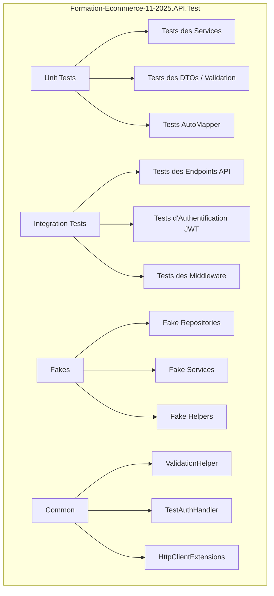

# Guide de Création des Tests pour Formation-Ecommerce-API

Ce guide détaille chaque étape pour créer une couche de tests complète pour le projet API, similaire à celle existante pour le projet MVC.

---

## Vue d'ensemble de l'architecture des tests



---

## Checklist d'implémentation

### Phase 1 : Création du projet de tests

#### [ ] 1.1 Créer le projet xUnit

**Commande :**
```powershell
cd "C:\Users\oussa\OneDrive\Desktop\Formation\Projet full stack MVC\Projet extensions\Projet API"
dotnet new xunit -n Formation-Ecommerce-11-2025.API.Test
```

**Pourquoi ?**
> xUnit est le framework de tests le plus moderne et recommandé pour .NET. Il offre :
> - Une syntaxe propre avec `[Fact]` et `[Theory]`
> - Une exécution parallèle des tests par défaut
> - Une bonne intégration avec Visual Studio et `dotnet test`
> - Support natif de l'injection de dépendances via fixtures (`IClassFixture`)

---

#### [ ] 1.2 Ajouter le projet à la solution

**Commande :**
```powershell
dotnet sln Formation-Ecommerce-API.sln add Formation-Ecommerce-11-2025.API.Test/Formation-Ecommerce-11-2025.API.Test.csproj
```

**Pourquoi ?**
> Ajouter le projet à la solution permet :
> - De restaurer et builder tous les projets ensemble avec `dotnet build`
> - D'exécuter tous les tests avec une seule commande `dotnet test`
> - Une meilleure expérience dans Visual Studio (vue unifiée)

---

#### [ ] 1.3 Configurer le fichier .csproj

**Contenu du fichier `Formation-Ecommerce-11-2025.API.Test.csproj` :**
```xml
<Project Sdk="Microsoft.NET.Sdk">

  <PropertyGroup>
    <TargetFramework>net8.0</TargetFramework>
    <RootNamespace>Formation_Ecommerce_11_2025.API.Test</RootNamespace>
    <ImplicitUsings>enable</ImplicitUsings>
    <Nullable>enable</Nullable>
    <IsPackable>false</IsPackable>
    <IsTestProject>true</IsTestProject>
  </PropertyGroup>

  <!-- Packages de tests -->
  <ItemGroup>
    <PackageReference Include="coverlet.collector" Version="6.0.0" />
    <PackageReference Include="Microsoft.NET.Test.Sdk" Version="17.8.0" />
    <PackageReference Include="xunit" Version="2.5.3" />
    <PackageReference Include="xunit.runner.visualstudio" Version="2.5.3" />
    <PackageReference Include="Microsoft.AspNetCore.Mvc.Testing" Version="8.0.11" />
    <PackageReference Include="Microsoft.EntityFrameworkCore.InMemory" Version="8.0.11" />
  </ItemGroup>

  <!-- Framework ASP.NET Core pour les tests d'intégration -->
  <ItemGroup>
    <FrameworkReference Include="Microsoft.AspNetCore.App" />
  </ItemGroup>

  <!-- Références aux projets à tester -->
  <ItemGroup>
    <ProjectReference Include="..\Formation-Ecommerce-11-2025.API\Formation-Ecommerce-11-2025.API.csproj" />
    <ProjectReference Include="..\Formation-Ecommerce-11-2025.Application\Formation-Ecommerce-11-2025.Application.csproj" />
    <ProjectReference Include="..\Formation-Ecommerce-11-2025.Core\Formation-Ecommerce-11-2025.Core.csproj" />
    <ProjectReference Include="..\Formation-Ecommerce-11-2025.Infrastructure\Formation-Ecommerce-11-2025.Infrastructure.csproj" />
  </ItemGroup>

  <!-- Import global de xUnit -->
  <ItemGroup>
    <Using Include="Xunit" />
  </ItemGroup>

</Project>
```

**Pourquoi chaque package ?**

| Package | Rôle |
|---------|------|
| `coverlet.collector` | Collecte la couverture de code (code coverage) |
| `Microsoft.NET.Test.Sdk` | Infrastructure de base pour exécuter les tests .NET |
| `xunit` | Le framework de tests lui-même (assertions, attributes) |
| `xunit.runner.visualstudio` | Permet à Visual Studio de découvrir et exécuter les tests |
| `Microsoft.AspNetCore.Mvc.Testing` | `WebApplicationFactory` pour les tests d'intégration HTTP |
| `Microsoft.EntityFrameworkCore.InMemory` | Base de données en mémoire pour les tests (pas de SQL Server) |

---

### Phase 2 : Structure des dossiers

#### [ ] 2.1 Créer l'arborescence des dossiers

**Commandes :**
```powershell
cd Formation-Ecommerce-11-2025.API.Test
mkdir Unit
mkdir Integration  
mkdir Fakes
mkdir Common
```

**Structure finale :**
```
Formation-Ecommerce-11-2025.API.Test/
├── Unit/                     # Tests unitaires des services
├── Integration/              # Tests d'intégration HTTP
├── Fakes/                    # Faux repositories et services
├── Common/                   # Helpers réutilisables
└── Formation-Ecommerce-11-2025.API.Test.csproj
```

**Pourquoi cette structure ?**

| Dossier | Objectif |
|---------|----------|
| `Unit/` | Tests rapides, isolés, sans dépendances externes. Testent la logique métier des services. |
| `Integration/` | Tests qui démarrent le serveur API complet et font de vraies requêtes HTTP. |
| `Fakes/` | Implémentations mémoire des repositories/services pour remplacer EF Core. |
| `Common/` | Code partagé entre tests (helpers, extensions, base classes). |

---

### Phase 3 : Création des Fakes (Doublures de tests)

#### [ ] 3.1 Créer FakeProductRepository

**Fichier :** `Fakes/FakeProductRepository.cs`

```csharp
using Formation_Ecommerce_11_2025.Core.Entities.Category;
using Formation_Ecommerce_11_2025.Core.Entities.Product;
using Formation_Ecommerce_11_2025.Core.Interfaces.Repositories;

namespace Formation_Ecommerce_11_2025.API.Test.Fakes;

/// <summary>
/// Fake (en mémoire) de <see cref="IProductRepository" />.
/// </summary>
/// <remarks>
/// Objectif pédagogique :
/// - Simuler la persistance des produits sans EF Core.
/// - Fournir une implémentation simple pour les tests unitaires.
/// - Tracer le dernier produit mis à jour (LastUpdatedProduct).
/// </remarks>
public class FakeProductRepository : IProductRepository
{
    private readonly Dictionary<Guid, Product> _store = new();

    public Product? LastUpdatedProduct { get; private set; }

    public Task<Product> AddAsync(Product product)
    {
        if (product.Id == Guid.Empty)
            product.Id = Guid.NewGuid();

        product.Category ??= new Category 
        { 
            Id = product.CategoryId, 
            Name = string.Empty, 
            Description = string.Empty, 
            Products = new List<Product>() 
        };
        product.CartDetails ??= new List<Formation_Ecommerce_11_2025.Core.Entities.Cart.CartDetails>();

        _store[product.Id] = product;
        return Task.FromResult(product);
    }

    public Task<Product> ReadByIdAsync(Guid productId)
    {
        _store.TryGetValue(productId, out var product);
        return Task.FromResult(product!);
    }

    public Task<IEnumerable<Product>> ReadAllAsync() 
        => Task.FromResult<IEnumerable<Product>>(_store.Values.ToList());

    public Task UpdateAsync(Product product)
    {
        _store[product.Id] = product;
        LastUpdatedProduct = product;
        return Task.CompletedTask;
    }

    public Task DeleteAsync(Guid productId)
    {
        _store.Remove(productId);
        return Task.CompletedTask;
    }

    public Task<IEnumerable<Product>> GetProductsByCategoryId(Guid categoryId)
    {
        var list = _store.Values.Where(p => p.CategoryId == categoryId).ToList();
        return Task.FromResult<IEnumerable<Product>>(list);
    }

    public Task<Product> GetByIdAsync(Guid id) => ReadByIdAsync(id);
    public Task<IEnumerable<Product>> GetAllAsync() => ReadAllAsync();
    public Task Update(Product entity) => UpdateAsync(entity);
    public Task Remove(Product entity)
    {
        _store.Remove(entity.Id);
        return Task.CompletedTask;
    }
    public Task<int> SaveChangesAsync() => Task.FromResult(1);
}
```

**Pourquoi utiliser des Fakes plutôt que des Mocks ?**

> [!TIP]
> **Avantages des Fakes :**
> - Code lisible et explicite (pas de syntaxe mock complexe)
> - Comportement réaliste (vraie logique de stockage en mémoire)
> - Réutilisable dans plusieurs tests
> - Plus facile à débugger
>
> **Mocks (Moq, NSubstitute) :**
> - Utiles pour des interfaces simples
> - Plus flexibles pour simuler des cas edge (exceptions, etc.)
> - Mais syntaxe plus verbeuse

---

#### [ ] 3.2 Créer FakeCategoryRepository

**Fichier :** `Fakes/FakeCategoryRepository.cs`

```csharp
using Formation_Ecommerce_11_2025.Core.Entities.Category;
using Formation_Ecommerce_11_2025.Core.Interfaces.Repositories;

namespace Formation_Ecommerce_11_2025.API.Test.Fakes;

public class FakeCategoryRepository : ICategoryRepository
{
    private readonly Dictionary<Guid, Category> _store = new();

    public Task<Category> AddAsync(Category category)
    {
        if (category.Id == Guid.Empty)
            category.Id = Guid.NewGuid();
        
        category.Products ??= new List<Formation_Ecommerce_11_2025.Core.Entities.Product.Product>();
        _store[category.Id] = category;
        return Task.FromResult(category);
    }

    public Task<Category> GetByIdAsync(Guid id)
    {
        _store.TryGetValue(id, out var category);
        return Task.FromResult(category!);
    }

    public Task<IEnumerable<Category>> GetAllAsync()
        => Task.FromResult<IEnumerable<Category>>(_store.Values.ToList());

    public Task Update(Category category)
    {
        _store[category.Id] = category;
        return Task.CompletedTask;
    }

    public Task Remove(Category category)
    {
        _store.Remove(category.Id);
        return Task.CompletedTask;
    }

    public Task<int> SaveChangesAsync() => Task.FromResult(1);

    public Task<Guid?> GetCategoryIdByName(string name)
    {
        var category = _store.Values.FirstOrDefault(c => c.Name == name);
        return Task.FromResult(category?.Id);
    }
}
```

---

#### [ ] 3.3 Créer FakeCartRepository

**Fichier :** `Fakes/FakeCartRepository.cs`

```csharp
using Formation_Ecommerce_11_2025.Core.Entities.Cart;
using Formation_Ecommerce_11_2025.Core.Interfaces.Repositories;

namespace Formation_Ecommerce_11_2025.API.Test.Fakes;

public class FakeCartRepository : ICartRepository
{
    private readonly Dictionary<Guid, CartHeader> _store = new();

    public Task<CartHeader> AddAsync(CartHeader cartHeader)
    {
        if (cartHeader.CartHeaderId == Guid.Empty)
            cartHeader.CartHeaderId = Guid.NewGuid();
        
        cartHeader.CartDetails ??= new List<CartDetails>();
        _store[cartHeader.CartHeaderId] = cartHeader;
        return Task.FromResult(cartHeader);
    }

    public Task<CartHeader?> GetCartHeaderByUserIdAsync(string userId)
    {
        var cart = _store.Values.FirstOrDefault(c => c.UserId == userId);
        return Task.FromResult(cart);
    }

    public Task<CartHeader> GetByIdAsync(Guid id)
    {
        _store.TryGetValue(id, out var cart);
        return Task.FromResult(cart!);
    }

    public Task<IEnumerable<CartHeader>> GetAllAsync()
        => Task.FromResult<IEnumerable<CartHeader>>(_store.Values.ToList());

    public Task Update(CartHeader cartHeader)
    {
        _store[cartHeader.CartHeaderId] = cartHeader;
        return Task.CompletedTask;
    }

    public Task Remove(CartHeader cartHeader)
    {
        _store.Remove(cartHeader.CartHeaderId);
        return Task.CompletedTask;
    }

    public Task<int> SaveChangesAsync() => Task.FromResult(1);
}
```

---

#### [ ] 3.4 Créer FakeFileHelper

**Fichier :** `Fakes/FakeFileHelper.cs`

```csharp
using Formation_Ecommerce_11_2025.Application.Products.Interfaces;
using Microsoft.AspNetCore.Http;

namespace Formation_Ecommerce_11_2025.API.Test.Fakes;

/// <summary>
/// Fake de <see cref="IFileHelper"/> pour tester sans écriture disque.
/// </summary>
public class FakeFileHelper : IFileHelper
{
    public string? UploadReturnValue { get; set; }
    public int UploadCallCount { get; private set; }
    public int DeleteCallCount { get; private set; }

    public Task<string> UploadFile(IFormFile file, string folder)
    {
        UploadCallCount++;
        return Task.FromResult(UploadReturnValue ?? $"{folder}/{file.FileName}");
    }

    public void DeleteFile(string imagePath, string folder)
    {
        DeleteCallCount++;
    }
}
```

**Pourquoi tracker les appels ?**
> Les compteurs `UploadCallCount` et `DeleteCallCount` permettent de vérifier que le service a bien appelé les méthodes de gestion de fichiers dans les tests, sans réellement écrire sur disque.

---

#### [ ] 3.5 Créer FakeCategoryService

**Fichier :** `Fakes/FakeCategoryService.cs`

```csharp
using Formation_Ecommerce_11_2025.Application.Categories.Dtos;
using Formation_Ecommerce_11_2025.Application.Categories.Interfaces;

namespace Formation_Ecommerce_11_2025.API.Test.Fakes;

/// <summary>
/// Fake de <see cref="ICategoryServices"/> pour les tests unitaires.
/// </summary>
public class FakeCategoryService : ICategoryServices
{
    public Guid? CategoryIdByName { get; set; } = Guid.NewGuid();

    public Task<CategoryDto?> AddAsync(CreateCategoryDto dto) 
        => Task.FromResult<CategoryDto?>(new CategoryDto { Id = Guid.NewGuid(), Name = dto.Name });

    public Task DeleteAsync(Guid id) => Task.CompletedTask;

    public Task<IEnumerable<CategoryDto>> ReadAllAsync() 
        => Task.FromResult<IEnumerable<CategoryDto>>(new List<CategoryDto>());

    public Task<CategoryDto?> ReadByIdAsync(Guid id) 
        => Task.FromResult<CategoryDto?>(null);

    public Task UpdateAsync(UpdateCategoryDto dto) => Task.CompletedTask;

    public Task<Guid?> GetCategoryIdByName(string name) 
        => Task.FromResult(CategoryIdByName);
}
```

---

### Phase 4 : Dossier Common (Helpers partagés)

#### [ ] 4.1 Créer ValidationHelper

**Fichier :** `Common/ValidationHelper.cs`

```csharp
using System.ComponentModel.DataAnnotations;

namespace Formation_Ecommerce_11_2025.API.Test.Common;

/// <summary>
/// Helper pour valider un objet via les DataAnnotations.
/// </summary>
/// <remarks>
/// Dans les Controllers API, la validation est automatique via ModelBinding.
/// En tests unitaires, on reproduit cette validation manuellement.
/// </remarks>
public static class ValidationHelper
{
    public static IList<ValidationResult> Validate(object model)
    {
        var results = new List<ValidationResult>();
        var context = new ValidationContext(model);
        Validator.TryValidateObject(model, context, results, validateAllProperties: true);
        return results;
    }
}
```

**Pourquoi ?**
> - Les attributs `[Required]`, `[StringLength]`, `[Range]` ne sont pas validés automatiquement dans les tests unitaires
> - Ce helper simule ce que fait ASP.NET Core automatiquement dans un Controller

---

#### [ ] 4.2 Créer TestAuthHandler (pour les tests d'intégration avec JWT)

**Fichier :** `Common/TestAuthHandler.cs`

```csharp
using System.Security.Claims;
using System.Text.Encodings.Web;
using Microsoft.AspNetCore.Authentication;
using Microsoft.Extensions.Logging;
using Microsoft.Extensions.Options;

namespace Formation_Ecommerce_11_2025.API.Test.Common;

/// <summary>
/// Handler d'authentification de test qui bypasse JWT pour les tests d'intégration.
/// </summary>
public class TestAuthHandler : AuthenticationHandler<AuthenticationSchemeOptions>
{
    public const string AuthenticationScheme = "Test";
    public const string DefaultUserId = "test-user-id";
    public const string DefaultUserEmail = "test@example.com";
    public static string? TestUserRole { get; set; } = "User";

    public TestAuthHandler(
        IOptionsMonitor<AuthenticationSchemeOptions> options,
        ILoggerFactory logger,
        UrlEncoder encoder)
        : base(options, logger, encoder)
    {
    }

    protected override Task<AuthenticateResult> HandleAuthenticateAsync()
    {
        var claims = new List<Claim>
        {
            new(ClaimTypes.NameIdentifier, DefaultUserId),
            new(ClaimTypes.Email, DefaultUserEmail),
            new(ClaimTypes.Name, "Test User"),
        };

        if (!string.IsNullOrEmpty(TestUserRole))
        {
            claims.Add(new Claim(ClaimTypes.Role, TestUserRole));
        }

        var identity = new ClaimsIdentity(claims, AuthenticationScheme);
        var principal = new ClaimsPrincipal(identity);
        var ticket = new AuthenticationTicket(principal, AuthenticationScheme);

        return Task.FromResult(AuthenticateResult.Success(ticket));
    }
}
```

**Pourquoi ?**
> [!IMPORTANT]
> **Problème :** Les endpoints protégés par `[Authorize]` nécessitent un token JWT valide.
> 
> **Solution :** Ce handler remplace l'authentification JWT par une authentification "fake" qui :
> - Simule un utilisateur connecté avec des claims prédéfinis
> - Permet de tester les rôles (`Admin`, `User`)
> - Évite de générer de vrais tokens JWT dans les tests

---

### Phase 5 : Tests d'intégration

#### [ ] 5.1 Créer CustomWebApplicationFactory

**Fichier :** `Integration/CustomWebApplicationFactory.cs`

```csharp
using Formation_Ecommerce_11_2025.API.Test.Common;
using Formation_Ecommerce_11_2025.Infrastructure.Persistence;
using Microsoft.AspNetCore.Authentication;
using Microsoft.AspNetCore.Hosting;
using Microsoft.AspNetCore.Mvc.Testing;
using Microsoft.EntityFrameworkCore;
using Microsoft.Extensions.DependencyInjection;

namespace Formation_Ecommerce_11_2025.API.Test.Integration;

/// <summary>
/// Factory de tests d'intégration basée sur <see cref="WebApplicationFactory{TEntryPoint}" />.
/// </summary>
/// <remarks>
/// Cette factory permet de démarrer l'API ASP.NET Core "en mémoire" pour des tests HTTP.
/// 
/// Points clés :
/// - Remplacement de la DB par EF Core InMemory
/// - Remplacement de l'authentification JWT par un handler de test
/// - Nom de base unique pour éviter les interférences entre tests
/// </remarks>
public class CustomWebApplicationFactory : WebApplicationFactory<Program>
{
    protected override void ConfigureWebHost(IWebHostBuilder builder)
    {
        builder.UseEnvironment("Development");

        builder.ConfigureServices(services =>
        {
            // 1. Remplacer la base de données par InMemory
            var dbContextDescriptor = services
                .SingleOrDefault(d => d.ServiceType == typeof(DbContextOptions<ApplicationDbContext>));
            
            if (dbContextDescriptor != null)
                services.Remove(dbContextDescriptor);

            services.AddDbContext<ApplicationDbContext>(options =>
            {
                options.UseInMemoryDatabase($"FormationEcommerceApiTests_{Guid.NewGuid()}");
            });

            // 2. Remplacer l'authentification JWT par un handler de test
            services.AddAuthentication(TestAuthHandler.AuthenticationScheme)
                .AddScheme<AuthenticationSchemeOptions, TestAuthHandler>(
                    TestAuthHandler.AuthenticationScheme, options => { });

            // 3. S'assurer que la DB est créée
            using var serviceProvider = services.BuildServiceProvider();
            using var scope = serviceProvider.CreateScope();
            var db = scope.ServiceProvider.GetRequiredService<ApplicationDbContext>();
            db.Database.EnsureCreated();
        });
    }
}
```

**Pourquoi utiliser `WebApplicationFactory` ?**

> [!NOTE]
> `WebApplicationFactory<TEntryPoint>` est la méthode officielle Microsoft pour les tests d'intégration ASP.NET Core.
>
> **Avantages :**
> - Démarre un vrai serveur HTTP en mémoire
> - Utilise la même configuration DI que l'app réelle
> - Permet de remplacer des services (DB, Auth, etc.)
> - Tests plus réalistes qu'avec des mocks

**Pourquoi un nom de DB unique (`Guid.NewGuid()`) ?**
> Chaque test obtient sa propre base de données en mémoire, évitant les conflits de données entre tests parallèles.

---

#### [ ] 5.2 Créer les Smoke Tests pour les endpoints publics

**Fichier :** `Integration/ProductsEndpointTests.cs`

```csharp
using System.Net;
using System.Net.Http.Json;

namespace Formation_Ecommerce_11_2025.API.Test.Integration;

/// <summary>
/// Tests d'intégration des endpoints Products.
/// </summary>
public class ProductsEndpointTests : IClassFixture<CustomWebApplicationFactory>
{
    private readonly HttpClient _client;

    public ProductsEndpointTests(CustomWebApplicationFactory factory)
    {
        _client = factory.CreateClient();
    }

    [Fact]
    public async Task GetAllProducts_ReturnsOk()
    {
        // Act
        var response = await _client.GetAsync("/api/Products");

        // Assert
        Assert.Equal(HttpStatusCode.OK, response.StatusCode);
    }

    [Fact]
    public async Task GetProductById_NotFound_Returns404()
    {
        // Act
        var response = await _client.GetAsync($"/api/Products/{Guid.NewGuid()}");

        // Assert
        Assert.Equal(HttpStatusCode.NotFound, response.StatusCode);
    }
}
```

**Pourquoi `IClassFixture<CustomWebApplicationFactory>` ?**
> - xUnit crée une seule instance de `CustomWebApplicationFactory` partagée entre tous les tests de la classe
> - Le serveur n'est démarré qu'une fois, ce qui accélère les tests
> - Chaque test peut créer son propre `HttpClient`

---

#### [ ] 5.3 Créer les tests pour les endpoints protégés

**Fichier :** `Integration/AuthorizedEndpointTests.cs`

```csharp
using System.Net;
using System.Net.Http.Headers;
using System.Net.Http.Json;
using Formation_Ecommerce_11_2025.API.Test.Common;
using Formation_Ecommerce_11_2025.Application.Products.Dtos;

namespace Formation_Ecommerce_11_2025.API.Test.Integration;

/// <summary>
/// Tests des endpoints nécessitant une authentification.
/// </summary>
public class AuthorizedEndpointTests : IClassFixture<CustomWebApplicationFactory>
{
    private readonly HttpClient _client;

    public AuthorizedEndpointTests(CustomWebApplicationFactory factory)
    {
        _client = factory.CreateClient();
        // Ajouter le schéma d'authentification de test
        _client.DefaultRequestHeaders.Authorization = 
            new AuthenticationHeaderValue(TestAuthHandler.AuthenticationScheme);
    }

    [Fact]
    public async Task CreateProduct_WithAuth_ReturnsCreated()
    {
        // Arrange
        TestAuthHandler.TestUserRole = "Admin"; // Simuler un admin
        
        var newProduct = new CreateProductDto
        {
            Name = "Test Product",
            Description = "Test Description",
            Price = 99.99m,
            CategoryID = Guid.NewGuid()
        };

        // Act
        var response = await _client.PostAsJsonAsync("/api/Products", newProduct);

        // Assert
        // Note: Peut retourner BadRequest si la catégorie n'existe pas
        Assert.True(
            response.StatusCode == HttpStatusCode.Created || 
            response.StatusCode == HttpStatusCode.BadRequest);
    }

    [Fact]
    public async Task CreateProduct_WithoutAuth_ReturnsUnauthorized()
    {
        // Arrange
        var unauthenticatedClient = new CustomWebApplicationFactory()
            .CreateClient();
        
        var newProduct = new CreateProductDto
        {
            Name = "Test Product",
            Description = "Test Description",
            Price = 99.99m,
            CategoryID = Guid.NewGuid()
        };

        // Act
        var response = await unauthenticatedClient.PostAsJsonAsync("/api/Products", newProduct);

        // Assert
        Assert.Equal(HttpStatusCode.Unauthorized, response.StatusCode);
    }
}
```

---

#### [ ] 5.4 Créer les tests des endpoints Categories

**Fichier :** `Integration/CategoriesEndpointTests.cs`

```csharp
using System.Net;
using System.Net.Http.Json;

namespace Formation_Ecommerce_11_2025.API.Test.Integration;

/// <summary>
/// Tests d'intégration des endpoints Categories.
/// </summary>
public class CategoriesEndpointTests : IClassFixture<CustomWebApplicationFactory>
{
    private readonly HttpClient _client;

    public CategoriesEndpointTests(CustomWebApplicationFactory factory)
    {
        _client = factory.CreateClient();
    }

    [Fact]
    public async Task GetAllCategories_ReturnsOk()
    {
        // Act
        var response = await _client.GetAsync("/api/Categories");

        // Assert
        Assert.Equal(HttpStatusCode.OK, response.StatusCode);
    }
}
```

---

### Phase 6 : Tests Unitaires

#### [ ] 6.1 Créer les tests du ProductServices

**Fichier :** `Unit/ProductServicesTests.cs`

```csharp
using AutoMapper;
using Formation_Ecommerce_11_2025.API.Test.Fakes;
using Formation_Ecommerce_11_2025.Application.Products.Dtos;
using Formation_Ecommerce_11_2025.Application.Products.Mapping;
using Formation_Ecommerce_11_2025.Application.Products.Services;
using Formation_Ecommerce_11_2025.Core.Entities.Category;
using Formation_Ecommerce_11_2025.Core.Entities.Product;
using Microsoft.AspNetCore.Http;

namespace Formation_Ecommerce_11_2025.API.Test.Unit;

/// <summary>
/// Tests unitaires de ProductServices (CRUD + gestion d'image).
/// </summary>
public class ProductServicesTests
{
    private static IMapper CreateMapper()
    {
        var config = new MapperConfiguration(cfg => cfg.AddProfile<ProductProfile>());
        return config.CreateMapper();
    }

    [Fact]
    public async Task AddAsync_WithoutImage_DoesNotUploadFile()
    {
        // Arrange
        var productRepo = new FakeProductRepository();
        var fileHelper = new FakeFileHelper();
        var categoryService = new FakeCategoryService();
        var service = new ProductServices(productRepo, CreateMapper(), categoryService, fileHelper);

        var dto = new CreateProductDto
        {
            Name = "Prod",
            Price = 10m,
            Description = "Desc",
            CategoryID = Guid.NewGuid(),
            ImageFile = null
        };

        // Act
        var result = await service.AddAsync(dto);

        // Assert
        Assert.NotNull(result);
        Assert.Equal(0, fileHelper.UploadCallCount);
        Assert.Null(result!.ImageUrl);
    }

    [Fact]
    public async Task AddAsync_WithImage_UploadsFileAndSetsImageUrl()
    {
        // Arrange
        var productRepo = new FakeProductRepository();
        var fileHelper = new FakeFileHelper { UploadReturnValue = "new.png" };
        var categoryService = new FakeCategoryService();
        var service = new ProductServices(productRepo, CreateMapper(), categoryService, fileHelper);

        var file = new FormFile(new MemoryStream(new byte[] { 1, 2, 3 }), 0, 3, "ImageFile", "img.png");

        var dto = new CreateProductDto
        {
            Name = "Prod",
            Price = 10m,
            Description = "Desc",
            CategoryID = Guid.NewGuid(),
            ImageFile = file
        };

        // Act
        var result = await service.AddAsync(dto);

        // Assert
        Assert.NotNull(result);
        Assert.Equal(1, fileHelper.UploadCallCount);
        Assert.Equal("new.png", result!.ImageUrl);
    }

    [Fact]
    public async Task ReadByIdAsync_WhenNotFound_ThrowsKeyNotFoundException()
    {
        // Arrange
        var productRepo = new FakeProductRepository();
        var fileHelper = new FakeFileHelper();
        var categoryService = new FakeCategoryService();
        var service = new ProductServices(productRepo, CreateMapper(), categoryService, fileHelper);

        // Act & Assert
        await Assert.ThrowsAsync<KeyNotFoundException>(() => service.ReadByIdAsync(Guid.NewGuid()));
    }

    [Fact]
    public async Task DeleteAsync_WhenProductHasImage_DeletesFile()
    {
        // Arrange
        var productRepo = new FakeProductRepository();
        var fileHelper = new FakeFileHelper();
        var categoryService = new FakeCategoryService();
        var service = new ProductServices(productRepo, CreateMapper(), categoryService, fileHelper);

        var category = new Category
        {
            Id = Guid.NewGuid(),
            Name = "Cat",
            Description = "Desc",
            Products = new List<Product>()
        };

        var product = await productRepo.AddAsync(new Product
        {
            Id = Guid.NewGuid(),
            Name = "Prod",
            Description = "Desc",
            Price = 10m,
            ImageUrl = "old.png",
            CategoryId = category.Id,
            Category = category,
            CartDetails = new List<Formation_Ecommerce_11_2025.Core.Entities.Cart.CartDetails>()
        });

        // Act
        await service.DeleteAsync(product.Id);

        // Assert
        Assert.Equal(1, fileHelper.DeleteCallCount);
    }
}
```

---

#### [ ] 6.2 Créer les tests de validation DTO

**Fichier :** `Unit/DtoValidationTests.cs`

```csharp
using Formation_Ecommerce_11_2025.API.Test.Common;
using Formation_Ecommerce_11_2025.Application.Products.Dtos;

namespace Formation_Ecommerce_11_2025.API.Test.Unit;

/// <summary>
/// Tests de validation des DTOs via DataAnnotations.
/// </summary>
public class DtoValidationTests
{
    [Fact]
    public void CreateProductDto_WithEmptyName_HasValidationError()
    {
        // Arrange
        var dto = new CreateProductDto
        {
            Name = "",
            Price = 10m,
            Description = "Desc",
            CategoryID = Guid.NewGuid()
        };

        // Act
        var results = ValidationHelper.Validate(dto);

        // Assert
        Assert.NotEmpty(results);
        Assert.Contains(results, r => r.MemberNames.Contains("Name"));
    }

    [Fact]
    public void CreateProductDto_WithValidData_HasNoValidationErrors()
    {
        // Arrange
        var dto = new CreateProductDto
        {
            Name = "Valid Product",
            Price = 10m,
            Description = "Valid Description",
            CategoryID = Guid.NewGuid()
        };

        // Act
        var results = ValidationHelper.Validate(dto);

        // Assert
        Assert.Empty(results);
    }
}
```

---

#### [ ] 6.3 Créer les tests AutoMapper

**Fichier :** `Unit/AutoMapperProfileTests.cs`

```csharp
using AutoMapper;
using Formation_Ecommerce_11_2025.Application.Products.Mapping;
using Formation_Ecommerce_11_2025.Application.Categories.Mapping;

namespace Formation_Ecommerce_11_2025.API.Test.Unit;

/// <summary>
/// Tests de configuration AutoMapper.
/// </summary>
public class AutoMapperProfileTests
{
    [Fact]
    public void ProductProfile_ConfigurationIsValid()
    {
        // Arrange
        var config = new MapperConfiguration(cfg => cfg.AddProfile<ProductProfile>());

        // Act & Assert
        config.AssertConfigurationIsValid();
    }

    [Fact]
    public void CategoryProfile_ConfigurationIsValid()
    {
        // Arrange
        var config = new MapperConfiguration(cfg => cfg.AddProfile<CategoryProfile>());

        // Act & Assert
        config.AssertConfigurationIsValid();
    }
}
```

**Pourquoi tester les profils AutoMapper ?**
> [!WARNING]
> **Erreur courante :** Un mapping mal configuré ne provoque pas d'erreur de compilation.
> L'erreur n'apparaît qu'au runtime quand on appelle `_mapper.Map<>()`.
> 
> `config.AssertConfigurationIsValid()` détecte ces problèmes dès les tests.

---

### Phase 7 : Exécution et couverture de code

#### [ ] 7.1 Exécuter tous les tests

```powershell
cd "C:\Users\oussa\OneDrive\Desktop\Formation\Projet full stack MVC\Projet extensions\Projet API"

# Restore + Build + Test
dotnet test Formation-Ecommerce-API.sln

# Tests sans restore (plus rapide)
dotnet test Formation-Ecommerce-API.sln --no-restore

# Avec verbosité détaillée
dotnet test Formation-Ecommerce-API.sln --verbosity normal
```

---

#### [ ] 7.2 Générer un rapport de couverture

```powershell
# Installer l'outil de rapport (une seule fois)
dotnet tool install --global dotnet-reportgenerator-globaltool

# Exécuter les tests avec collecte de couverture
dotnet test --collect:"XPlat Code Coverage"

# Générer le rapport HTML
reportgenerator -reports:"**/coverage.cobertura.xml" -targetdir:"CoverageReport" -reporttypes:Html
```

---

### Phase 8 : Fichiers supplémentaires

#### [ ] 8.1 Créer le README.md du projet de tests

**Fichier :** `README.md`

```markdown
# Formation-Ecommerce-11-2025.API.Test

Projet de tests automatisés (xUnit) pour l'API E-Commerce.

## Structure

| Dossier | Description |
|---------|-------------|
| `Unit/` | Tests unitaires des services Application |
| `Integration/` | Tests HTTP via WebApplicationFactory |
| `Fakes/` | Implémentations mémoire des repositories |
| `Common/` | Helpers réutilisables |

## Exécution

```powershell
dotnet test Formation-Ecommerce-API.sln
```

## Différences vs tests MVC

| Aspect | Tests MVC | Tests API |
|--------|-----------|-----------|
| Auth | Cookies/Session | JWT Bearer (TestAuthHandler) |
| Réponses | HTML Views | JSON |
| Routes | `/Product/Index` | `/api/Products` |
```

---

## Résumé des différences entre Tests MVC et Tests API

| Aspect | Projet MVC (.Test) | Projet API (.API.Test) |
|--------|-------------------|------------------------|
| **Authentification** | Cookies + ModelState | JWT Bearer tokens |
| **Réponses attendues** | HTML (Views) | JSON |
| **Routes testées** | `/Product/ProductIndex` | `/api/Products` |
| **Test Auth Handler** | Non nécessaire (cookies) | `TestAuthHandler` pour simuler JWT |
| **Swagger** | ❌ | ✅ Peut tester les endpoints documentés |

---

## Commandes récapitulatives

```powershell
# 1. Créer le projet
dotnet new xunit -n Formation-Ecommerce-11-2025.API.Test

# 2. Ajouter à la solution
dotnet sln Formation-Ecommerce-API.sln add Formation-Ecommerce-11-2025.API.Test/Formation-Ecommerce-11-2025.API.Test.csproj

# 3. Créer les dossiers
mkdir Unit, Integration, Fakes, Common

# 4. Lancer les tests
dotnet test Formation-Ecommerce-API.sln
```

---

> [!TIP]
> **Bonnes pratiques de nommage des tests :**
> - `MethodName_Scenario_ExpectedResult`
> - Exemple : `AddAsync_WithImage_UploadsFileAndSetsImageUrl`
