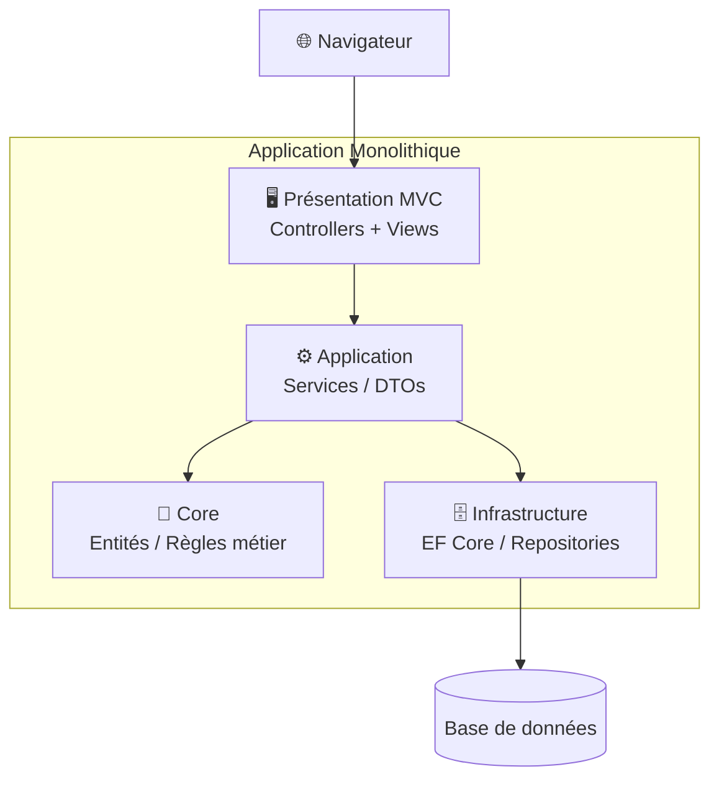
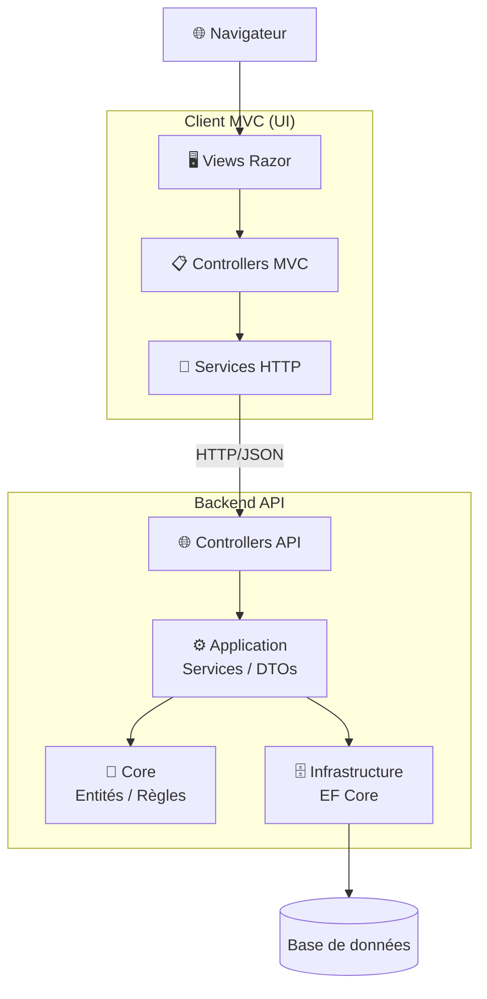
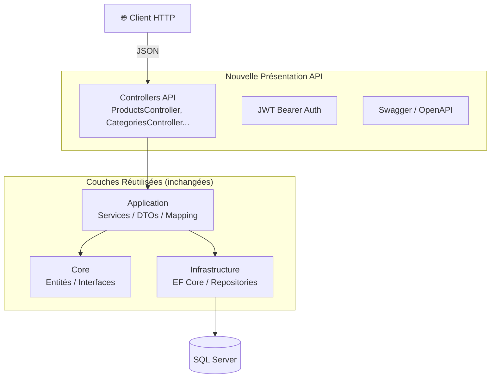
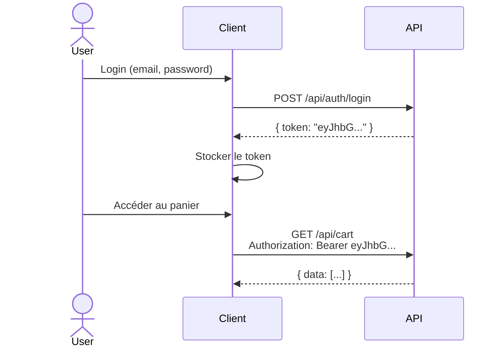
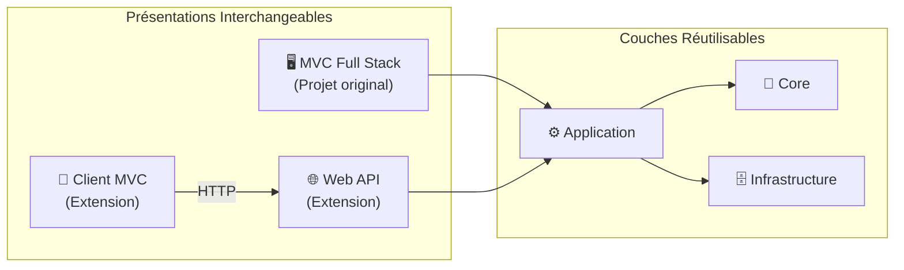

# Extension Formation — Refactoring vers API + Client MVC (Clean Architecture)

## Sommaire
- [Objectif pédagogique](#objectif-pédagogique)
- [Pourquoi cette extension ?](#pourquoi-cette-extension-)
- [La preuve par l'exemple : Clean Architecture en action](#la-preuve-par-lexemple--clean-architecture-en-action)
- [Architecture avant vs après](#architecture-avant-vs-après)
- [Ce qui ne change pas (réutilisation)](#ce-qui-ne-change-pas-réutilisation)
- [Ce qui change (remplacement de couche)](#ce-qui-change-remplacement-de-couche)
- [Structure des projets](#structure-des-projets)
- [Projet API — Nouvelle couche Présentation](#projet-api--nouvelle-couche-présentation)
- [Projet Client MVC — Consommation de l'API](#projet-client-mvc--consommation-de-lapi)
- [Lancer les projets](#lancer-les-projets)
- [Tests automatisés](#tests-automatisés)
- [Points clés à retenir](#points-clés-à-retenir)

---

## Objectif pédagogique

Cette extension de formation démontre **concrètement** la puissance de la **Clean Architecture** en transformant une application e-commerce Full Stack MVC en **deux applications distinctes** :

1. **Backend API** : expose les fonctionnalités métier via des endpoints REST
2. **Client MVC** : interface utilisateur consommant l'API

> [!IMPORTANT]
> **L'objectif n'est pas de réécrire l'application**, mais de montrer qu'avec une bonne architecture, on peut **remplacer une couche entière sans toucher au reste du code**.

---

## Pourquoi cette extension ?

### Le problème avec une architecture monolithique classique
Dans une application mal structurée, le code métier est souvent mélangé avec le code de présentation :
- Les contrôleurs MVC contiennent de la logique métier
- Les modifications de l'UI impactent le backend
- Impossible de réutiliser le code pour une API mobile ou une SPA

### La solution : Clean Architecture
Avec la Clean Architecture, les couches sont **indépendantes** :
- Le **Core** (entités, règles métier) ne connaît pas l'UI
- L'**Application** (cas d'usage) ne sait pas comment les données sont affichées
- L'**Infrastructure** (base de données) peut être changée sans impact métier
- La **Présentation** est **interchangeable**

---

## La preuve par l'exemple : Clean Architecture en action

Cette extension prouve que la Clean Architecture fonctionne en réalisant ce défi :

```
✅ Remplacer la couche Présentation MVC par une couche API
   → Sans modifier une seule ligne de code dans Core, Application ou Infrastructure

✅ Créer un Client MVC qui consomme l'API
   → En réutilisant les mêmes Views et ViewModels
```

### Résultat concret
| Couche | Projet original | Extension API | Extension Client |
|--------|-----------------|---------------|------------------|
| Core | ✅ Original | ✅ **Réutilisé tel quel** | — |
| Application | ✅ Original | ✅ **Réutilisé tel quel** | — |
| Infrastructure | ✅ Original | ✅ **Réutilisé tel quel** | — |
| Présentation MVC | ✅ Original | ❌ Remplacée par API | ✅ Adapté (Services HTTP) |

---

## Architecture avant vs après

### Avant : Full Stack MVC (monolithique)



### Après : API + Client MVC (découplé)



---

## Ce qui ne change pas (réutilisation)

Les couches suivantes sont **copiées sans modification** du projet original vers l'API :

### 📦 Core (Formation-Ecommerce.Core)
```
✅ Entités métier (Product, Category, Order, Cart, User...)
✅ Interfaces des repositories
✅ Règles de validation métier
✅ BaseEntity, Common
```

### 📦 Application (Formation-Ecommerce.Application)
```
✅ Services applicatifs (ProductService, OrderService...)
✅ DTOs (CreateProductDto, ProductDto...)
✅ Interfaces de services
✅ Mapping AutoMapper
✅ Registration DI (AddApplicationRegistration)
```

### 📦 Infrastructure (Formation-Ecommerce.Infrastructure)
```
✅ DbContext EF Core
✅ Repositories (ProductRepository, CategoryRepository...)
✅ Configurations d'entités
✅ Services externes (EmailSender, FileHelper)
✅ Registration DI (AddInfrastructureRegistration)
```

> [!NOTE]
> **Zéro ligne de code modifiée** dans ces 3 couches. Elles fonctionnent aussi bien derrière une API que derrière un MVC classique.

---

## Ce qui change (remplacement de couche)

### Ancienne Présentation : MVC
```csharp
// Controller MVC (avant)
public class ProductController : Controller
{
    public async Task<IActionResult> Index()
    {
        var products = await _productService.ReadAllAsync();
        return View(products);  // ← Retourne une View Razor
    }
}
```

### Nouvelle Présentation : API
```csharp
// Controller API (après)
[ApiController]
[Route("api/[controller]")]
public class ProductsController : ControllerBase
{
    public async Task<IActionResult> GetAll()
    {
        var products = await _productService.ReadAllAsync();
        return Ok(new ApiResponse<IEnumerable<ProductDto>> 
        { 
            Success = true, 
            Data = products 
        });  // ← Retourne du JSON
    }
}
```

**Différences clés :**
| Aspect | MVC | API |
|--------|-----|-----|
| Retour | `View(model)` | `Ok(json)` / `BadRequest()` |
| Auth | Cookies | JWT Bearer |
| Erreurs | Pages HTML | Réponses JSON |
| CORS | Non nécessaire | Requis |
| Documentation | — | Swagger |

---

## Structure des projets

```
📁 Projet extensions/
├── 📁 Projet API/                          # Backend REST API
│   ├── Formation-Ecommerce-API.sln
│   ├── 📁 Formation-Ecommerce.API/     # Nouvelle couche Présentation
│   ├── 📁 Formation-Ecommerce.Application/  # ✅ Réutilisé
│   ├── 📁 Formation-Ecommerce.Core/         # ✅ Réutilisé
│   ├── 📁 Formation-Ecommerce.Infrastructure/ # ✅ Réutilisé
│   └── 📁 Formation-Ecommerce.Test/    # Tests API (34 tests)
│
├── 📁 Projet CLient MVC/                   # Frontend MVC
│   └── 📁 Formation-Ecommerce-Client/
│       ├── Formation-Ecommerce-Client.sln
│       ├── 📁 Controllers/                 # Controllers adaptés
│       ├── 📁 Views/                       # ✅ Vues réutilisées
│       ├── 📁 Models/ViewModels/           # ✅ ViewModels réutilisés
│       ├── 📁 Services/                    # 🆕 Services HTTP
│       └── 📁 Formation-Ecommerce-Client.Test/  # Tests Client (21 tests)
│
└── README.md                               # Ce fichier
```

---

## Projet API — Nouvelle couche Présentation

### Architecture


### Structure du projet API
```
📁 Formation-Ecommerce.API/        # 🆕 Nouvelle couche
├── Controllers/
│   ├── AuthController.cs                  # Authentification JWT
│   ├── ProductsController.cs
│   ├── CategoriesController.cs
│   ├── CartController.cs
│   ├── CouponController.cs
│   └── OrdersController.cs
├── Common/
│   └── ApiResponse.cs                     # Format réponse standard
└── Program.cs                             # Configuration DI, JWT, Swagger
```

### Réutilisation via Injection de Dépendances
```csharp
// Program.cs - Les mêmes registrations que le MVC !
builder.Services.AddApplicationRegistration();
builder.Services.AddInfrastructureRegistration(
    builder.Configuration, 
    builder.Environment);
```

### Endpoints disponibles

#### Produits
| Méthode | Endpoint | Auth | Description |
|---------|----------|------|-------------|
| GET | `/api/products` | ❌ | Liste tous les produits |
| GET | `/api/products/{id}` | ❌ | Détails d'un produit |
| POST | `/api/products` | ✅ Admin | Créer un produit |
| PUT | `/api/products/{id}` | ✅ Admin | Modifier un produit |
| DELETE | `/api/products/{id}` | ✅ Admin | Supprimer un produit |

#### Catégories
| Méthode | Endpoint | Auth | Description |
|---------|----------|------|-------------|
| GET | `/api/categories` | ❌ | Liste les catégories |
| POST | `/api/categories` | ✅ Admin | Créer une catégorie |

#### Panier & Commandes
| Méthode | Endpoint | Auth | Description |
|---------|----------|------|-------------|
| GET | `/api/cart` | ✅ User | Récupérer le panier |
| POST | `/api/cart` | ✅ User | Ajouter au panier |
| POST | `/api/orders` | ✅ User | Créer une commande |

#### Authentification
| Méthode | Endpoint | Description |
|---------|----------|-------------|
| POST | `/api/auth/register` | Inscription |
| POST | `/api/auth/login` | Connexion (retourne JWT) |

### Authentification JWT


---

## Projet Client MVC — Consommation de l'API

### Ce qui est réutilisé
- **Views Razor** : les mêmes fichiers `.cshtml`
- **ViewModels** : les mêmes classes de modèles d'affichage
- **Layout et CSS** : l'UI reste identique

### Ce qui est adapté
Les Controllers ne appellent plus directement les services Application :

```csharp
// Avant (MVC Full Stack)
public class ProductController : Controller
{
    private readonly IProductService _productService;  // Service Application
    
    public async Task<IActionResult> Index()
    {
        var products = await _productService.ReadAllAsync();
        return View(products);
    }
}

// Après (Client MVC)
public class ProductController : Controller
{
    private readonly IProductApiService _productService;  // Service HTTP
    
    public async Task<IActionResult> ProductIndex()
    {
        var products = await _productService.GetAllAsync();  // Appel API
        return View(products);
    }
}
```

### Structure du projet Client
```
📁 Formation-Ecommerce-Client/
├── 📁 Controllers/                    # 🔄 Adaptés
├── 📁 Views/                          # ✅ Réutilisées
├── 📁 Models/ViewModels/              # ✅ Réutilisés
├── 📁 Services/                       # 🆕 Nouveaux
│   ├── Interfaces/
│   └── Implementations/
│       ├── ProductApiService.cs
│       ├── CategoryApiService.cs
│       ├── CartApiService.cs
│       └── AuthApiService.cs
└── Program.cs
```

### Services HTTP
```csharp
public class ProductApiService : IProductApiService
{
    private readonly HttpClient _httpClient;

    public async Task<IEnumerable<ProductViewModel>> GetAllAsync()
    {
        var response = await _httpClient.GetAsync("products");
        var result = await response.Content
            .ReadFromJsonAsync<ApiResponse<IEnumerable<ProductViewModel>>>();
        return result?.Data ?? Array.Empty<ProductViewModel>();
    }
}
```

### Gestion du token JWT
```csharp
// Stockage après login
HttpContext.Session.SetString("JwtToken", response.Token);

// Utilisation dans les services
var token = _httpContextAccessor.HttpContext?.Session.GetString("JwtToken");
_httpClient.DefaultRequestHeaders.Authorization = 
    new AuthenticationHeaderValue("Bearer", token);
```

---

## Lancer les projets

### Prérequis
- .NET 8+ SDK (API) / .NET 10 SDK (Client)
- SQL Server
- Configuration des appsettings.json

### Ordre de démarrage

```powershell
# 1. Démarrer l'API (obligatoire en premier)
cd "Projet API"
dotnet run --project Formation-Ecommerce-11-2025.API

# 2. Démarrer le Client MVC
cd "Projet CLient MVC/Formation-Ecommerce-Client"
dotnet run
```

### URLs par défaut
| Projet | URL |
|--------|-----|
| API | https://localhost:7000 |
| API Swagger | https://localhost:7000/swagger |
| Client MVC | https://localhost:5001 |

---

## Tests automatisés

### Tests API (34 tests)
```powershell
cd "Projet API"
dotnet test Formation-Ecommerce-API.sln
```

| Type | Fichiers | Description |
|------|----------|-------------|
| Fakes | 5 | Repositories et services simulés |
| Unit | 3 | ProductServices, DTOs, AutoMapper |
| Integration | 4 | Endpoints API avec WebApplicationFactory |

### Tests Client MVC (21 tests)
```powershell
cd "Projet CLient MVC/Formation-Ecommerce-Client"
dotnet test Formation-Ecommerce-Client.sln
```

| Type | Fichiers | Description |
|------|----------|-------------|
| Fakes | 3 | HTTP mocking (FakeHttpMessageHandler) |
| Unit | 2 | Services HTTP, ViewModels |
| Integration | 2 | Controllers avec Factory |

### Total : 55 tests ✅

---

## Points clés à retenir

### 1. La Clean Architecture permet le remplacement de couche
```
Le projet prouve qu'on peut remplacer la Présentation MVC 
par une Présentation API sans toucher au métier.
```

### 2. Les couches métier sont réutilisables
```
Core, Application et Infrastructure fonctionnent 
aussi bien derrière un MVC, une API, une CLI, ou un Blazor.
```

### 3. La séparation facilite les tests
```
Chaque couche peut être testée indépendamment :
- Unit tests pour la logique métier
- Integration tests pour les endpoints
- Mocking des dépendances HTTP
```

### 4. L'évolution est simplifiée
```
Besoin d'une app mobile ? → L'API existe déjà
Besoin d'une SPA React ? → L'API existe déjà
Besoin de GraphQL ? → Ajouter une nouvelle Présentation
```

---

## Diagramme récapitulatif



---

## Licence / Usage
Projet destiné à un usage pédagogique (formation Clean Architecture .NET).
